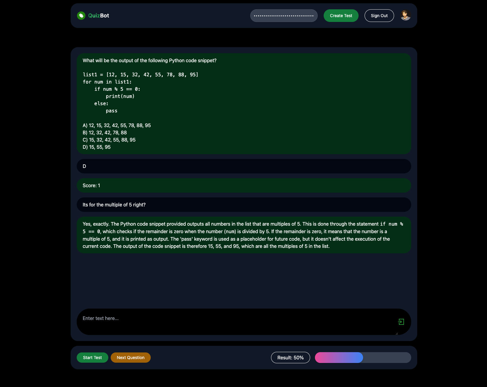

# QuizBot
QuizBot is an interactive platform that allows users to explore and share quizzes powered by ChatGPT. Users can dive into personalized tests on topics of their choosing, get questions marked in real-time, and if puzzled by an answer, chat directly with the AI to understand why. It serves as an interactive learning hub where curiosity meets clarity.



Features:
- User Authentication: The application provides Google authentication for users to sign in.
- Quiz Creation: Users can create personalized quizzes with specific prompts, tags, and titles.
- Quiz Exploration: The platform offers a feed where users can explore various quizzes created by others.
- Profile Management: Users can view and manage their profiles, including the quizzes they've created.
- Search Functionality: Users can search for quizzes based on tags or usernames.
- Chat Functionality: Users can chat with the AI to understand why a certain answer is correct or incorrect.
- Real-time Marking: The application marks the user's answers in real-time and provides feedback.

Technical Details:
- Stack: Next.js, React, TypeScript, Tailwind CSS, MongoDb Atlas, ChatGPT
- Deployment: Vercel
- APIs & Integrations: NextAuth for authentication with Google.
- Database Technologies: MongoDB


## Getting Started

First, run the development server:

```bash
npm run dev
# or
yarn dev
# or
pnpm dev
# or
bun dev
```

Open [http://localhost:3000](http://localhost:3000) with your browser to see the result.

## Demo
[](https://www.youtube.com/watch?v=02g7MAkJuHQ)
